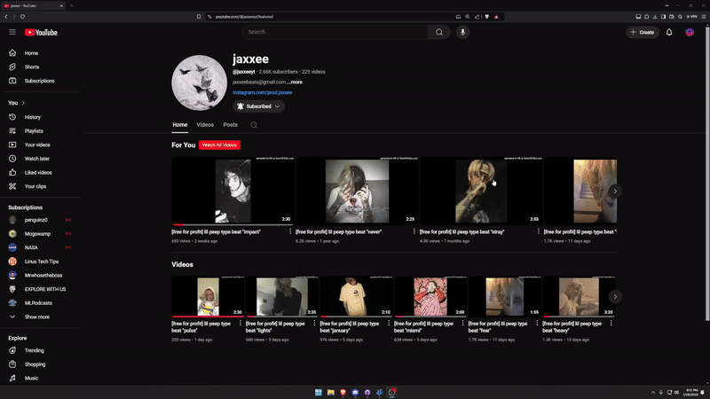

# WatchAll4YT

Short Description:
Adds a button on YouTube channel pages to open a playlist of all channel videos in one click.

  

## Installation
1. Clone or download this repository.
2. Go to chrome://extensions in Chrome.
3. Enable "Developer mode".
4. Click "Load unpacked" and select the folder with the manifest.json file.

## Usage
- Open any YouTube channel page.
- Click "Watch All Videos" to open the playlist with all videos.
